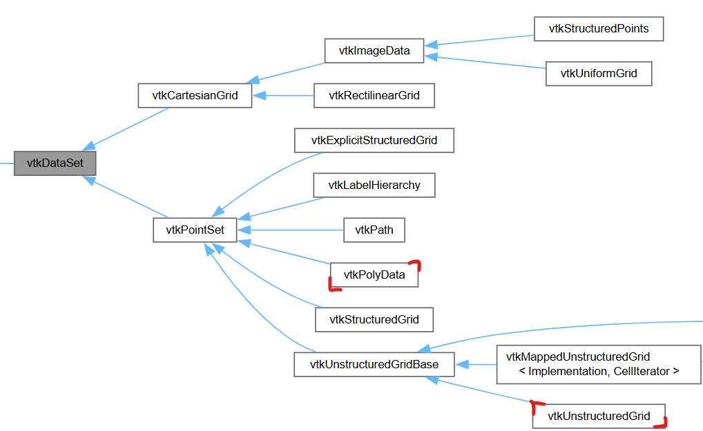

### [Resources]

- https://examples.vtk.org/site/

- https://docs.vtk.org/en/latest/

## VTK and Python

- https://examples.vtk.org/site/PythonicAPI/

# Concepts

- Actors
- Mappers
- Renderer
- RendererWindow
- RendererWindowInteractor
- InteractorStyle

 ## vtkDataSet

In vtk a dataset consists of a structure (geometry and topology) and attribute data.  
https://vtk.org/doc/nightly/html/classvtkDataSet.html

  

- https://vtk.org/doc/nightly/html/classvtkUnstructuredGrid.html

- https://vtk.org/doc/nightly/html/classvtkPolyData.html

## VTK Backends

- Qt
- Trame
- Jupyter